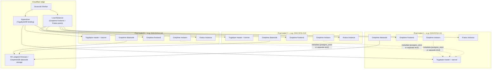

# Production 3-node HA plan + budget

Researched 2026-07-22, revised 2026-07-23 (grounded per-node resource
derivation, full OVH Eco Dedicated lineup, OVH VPS assessment, and a
SYS-2-vs-SYS-3 head-to-head — see those sections for what changed and
why). This doc **supersedes [`second-node-hosting.md`](./second-node-hosting.md)
for the 3-node/real-HA case** — that doc's YugabyteDB RF2/RF3 reasoning and its
GreptimeDB clustering-architecture explainer are still correct and referenced
below rather than repeated; its Hetzner-Server-Auction pick does **not**
carry over (it's EU-only — see below). Pricing is cited inline and will
drift — treat every number as "roughly this, as of this date," not a quote.

## TL;DR

- **Decided: node 1 is a home lab, and does not count as one of the 3 RF3
  voting members.** The budget below is **3 fresh US-East DC nodes** —
  node 1 is demoted to a dev/staging box and a cold backup/restore target,
  not a production quorum vote. Springfield, MA is still the **geographic
  anchor** that determines where those 3 new boxes should live (NJ/VA
  corridor, close by), it just isn't itself one of them anymore.
- **Decided: bare metal + Proxmox is the preference.** Per instruction,
  this doc quantifies exactly what that preference costs against the
  cheaper direct-services alternative, side by side — see the cost
  comparison section. Both totals are reported.
- **Revised per-node target, derived bottom-up from the actual components
  (not assumed): "minimum viable" ≈ 4 cores / 8GB; "comfortable headroom"
  ≈ 6-8 cores / 16-24GB.** This mostly **confirms** the original 8-core
  hypothesis rather than debunking it — YugabyteDB's own production-floor
  guidance alone (4-8 vCPU/node) plus co-locating a real GreptimeDB
  cluster role and Kratos on the same box adds back up to ~8 cores. The
  real slack turned out to be in **RAM**, not cores: 32GB was a safe
  buffer, but ~24GB is the honestly-derived comfortable ceiling. Full
  derivation below.
- **Revised primary recommendation: 3× OVH SoYouStart SYS-3 at Vint Hill,
  VA, running Proxmox — ≈ $60/mo/box, ≈ $180 total compute, ≈ $185-215/mo
  all-in.** A full survey of OVH's *entire* current Eco Dedicated lineup
  (not just the Rise tier looked at previously) turned up a same-hardware-
  class, same-generation-family box on the SoYouStart tier for **$20/mo
  less than the Rise-2 pick this doc previously led with** — see the new
  Eco lineup section for the full table and the support-tier tradeoff that
  comes with it.
- **Checked whether an even cheaper SoYouStart tier is adequate (SYS-2 vs.
  SYS-3 head-to-head, as requested): no.** SYS-2 itself couldn't be
  confirmed as currently orderable (its product page errored out on every
  fetch attempt and it's absent from OVH's live showcase), so the closest
  verifiable cheaper stand-in (SYS-1, 6c/12t, ~$33/mo) was compared
  instead — it clears the bare minimum-viable floor but falls short on
  **cores specifically**, this doc's own identified binding constraint:
  Yugabyte's 4-core production floor alone eats two-thirds of a 6-core
  box, leaving too little for the co-located Greptime cluster role +
  Kratos + overhead. SYS-3's extra 2 cores are worth the ~$80/mo premium
  (~$960/yr) — see the new head-to-head section.
- **New: an OVH VPS option was evaluated as requested and is honestly NOT
  recommended for this specific 3-node co-located design**, despite being
  dramatically cheaper (≈ $75-105/mo total) — OVH's VPS line is
  shared-vCPU only (no dedicated-vCPU VPS tier exists in that product
  family), and shared vCPU is a real risk specifically for YugabyteDB's
  Raft consensus and GreptimeDB's datanode I/O, not for the stateless
  Kratos/frontend tier. Because this plan co-locates the stateful and
  stateless tiers on the same 3 boxes, the risk profile of the riskiest
  service (Yugabyte) applies to the whole box. Full assessment below.
- **Runner-up bare-metal pick, if newest hardware/best support tier
  matters more than the $20/mo/box delta: OVH Rise-2** (same Vint Hill
  location, $80/mo) — still a fine choice, just no longer the top one.
  **Runner-up outside OVH: InterServer custom-build in Secaucus, NJ** —
  the metro physically closest to Springfield of everything surveyed, real
  bare metal, built-to-order (8-core AMD EPYC/192GB/4TB NVMe spotted at
  **~$119/mo**, more RAM than needed) [[2]](#sources), with a price-lock
  guarantee against renewal hikes.
- **GreptimeDB's open-source region-failover needs Kafka remote WAL to be
  fast/automatic** [[4]](#sources) — a finding that didn't exist to the
  same degree in the old doc's analysis. Given the existing
  Postgres-fallback (`write_telemetry_default`) already softens a Greptime
  outage, this pushes real datanode-level failover to a later phase, same
  spirit as the old doc's "is it worth it right now?" section.

## Grounding: what changed since the last doc

- The old doc's open questions (where node 1 lives, what RF/HA level is
  wanted) are now answered by the user directly: node 1 is near
  Springfield, MA, **and is a home lab, not a candidate voting member** —
  the target is **real 3-node automatic-failover HA (RF3)** across 3
  fresh DC nodes, not the 2-node data-redundancy-only step the old doc
  settled for, and not a mix of one home box + two rented ones either.
  Its RF2-vs-RF3 quorum math is unchanged and not repeated here; read it
  there if a refresher is needed.
- **New constraint this doc adds**: cluster all three stateful services
  (YugabyteDB, GreptimeDB, Kratos) onto the *same* 3 physical boxes, not 9
  separate ones. This is the single biggest cost lever in this plan — see
  the topology section.
- Node 1's current footprint is still not in this repo for YugabyteDB
  specifically (only the GreptimeDB LXC script is, at 2 cores/2GB/8+32GB
  disk — see `infra/proxmox-greptimedb-lxc.sh`). See the next section for
  how this doc now derives the target spec bottom-up instead of assuming
  it.

## Grounded per-node resource requirement: what do we actually need?

The original pass in this doc assumed an 8c/32GB/2×NVMe/1Gbps target as a
starting hypothesis. This section derives it bottom-up from the actual
components instead, at **current** small-IoT scale (the GreptimeDB
standalone LXC running today, `infra/proxmox-greptimedb-lxc.sh`, is the
only real footprint data point this repo has — everything else is
reasoned from each project's own documented guidance). Two bars are given,
per the request: **minimum viable** (will run, no slack — not a
recommendation to actually operate at) and **comfortable headroom**
(the real target).

| Component (per node) | Minimum viable | Comfortable headroom | Reasoning |
|---|---|---|---|
| YugabyteDB master + tserver | 2 cores / 2GB | **4 cores / 8-12GB** | YugabyteDB's own documented absolute floor is 2c/2GB — explicitly "will start," not a real-traffic target [[5]](#sources). But its **production cluster guidance is separately and specifically documented**: "a minimum of 3 nodes with 4 to 8 vCPUs per node is recommended" for production [[21]](#sources) — a real, specific number, not the enterprise-scale 16+-core/32-64GB+ language cited previously, which is for large clusters, not this stack. This doc targets the *low end* of that 4-8 vCPU band (4 cores) given hobby-to-small-IoT traffic. RAM isn't pinned as precisely in that same guidance; 8-12GB is this doc's own estimate, roughly following the same core-to-RAM ratio implied by Yugabyte's other sizing tables. |
| GreptimeDB cluster roles (metasrv + frontend + datanode, combined) | ~1.5 cores / 2GB | **~2-3 cores / 3-5GB** | Today's *entire* standalone binary (metasrv+frontend+datanode logic all in one process) runs comfortably in 2c/2GB (`proxmox-greptimedb-lxc.sh:46-47`) at real current traffic. Splitting into 3 separate clustered roles, each also replicated ×3 for HA, doesn't reduce total demand, and adds real overhead (heartbeats, region-metadata gossip, 3× the query-routing processes) — so this doc budgets somewhat *more* than today's combined 2c/2GB, not less, once split and clustered. |
| Kratos instance | ~0.25 core / 256MB | **~0.5 core / 0.5-1GB** | A near-idle stateless Go binary at this request volume; this is the cheapest tier by a wide margin regardless of bar. |
| etcd (only if chosen over postgres_store) | ~0.25 core / 512MB | **~0.5 core / 1GB** | Optional — see the metasrv metadata-backend section; $0 either way since it's compute already inside the box, not a separate bill line. |
| OS + Proxmox/Docker + cloudflared + monitoring overhead | ~0.5 core / 1GB | **~1 core / 2GB** | Real but small at this scale — one Cloudflare Tunnel daemon, one metrics/log agent, plus whatever Proxmox itself costs over bare Linux. |
| **Total per node** | **≈ 4 cores / ~5-6GB** (round up to **4c/8GB** for a real floor with zero contention margin) | **≈ 7-8.5 cores / ~15-19GB** (round to **6-8 cores / 16-24GB**) | |

**What this changes vs. the original hypothesis**: cores stay essentially
where they were — **8 cores is right-sized for comfortable headroom, not
oversized**, because co-locating three independently-clustered stateful
services on one box is a genuinely more demanding ask than any one of them
alone at hobby scale, and Yugabyte's own production-floor guidance (4-8
vCPU/node) already accounts for a meaningful chunk of that budget on its
own. **RAM is where the real slack was**: ~24GB comfortably covers the
derived total with room to spare, vs. the 32GB originally budgeted — a
~35% RAM buffer over the comfortable-headroom sum, which is a normal,
sane amount of margin for a production database tier, not a sign of
having over-asked. Both bars are used below to grade each SKU surveyed.

## Provider comparison — US-East bare metal, general survey

| Provider | Location | Real bare metal? | Spec at/near target | Cost (as of Jul 2026) | Notes |
|---|---|---|---|---|---|
| **OVH SoYouStart SYS-3** | Vint Hill, VA | Yes | Xeon-E 2288G, 8c/16t, 32-128GB, 2×960GB NVMe, 1-2Gbps | **~$60/mo** [[22]](#sources) | **Revised top pick** — see the full OVH Eco lineup section below for why this beats Rise-2 on value |
| OVH Rise-2 | Vint Hill, VA | Yes | Xeon-E 2388G, 8c/16t, 32-128GB, 2×512GB NVMe, 1-3Gbps | **~$80/mo** [[1]](#sources) | Previous top pick, still a solid runner-up — newer hardware generation, better support tier than SoYouStart |
| InterServer (custom) | Secaucus, NJ | Yes | AMD EPYC 4344P, 8c, 192GB, 4TB NVMe (oversized vs. target) | **~$119/mo** as-spotted [[2]](#sources) | Closest metro to Springfield surveyed; built-to-order, price-lock guarantee; a leaner custom config (32GB not 192GB) would likely be cheaper — get a real quote |
| Contabo dedicated | New York, NY (Manhattan) | Yes | AMD Ryzen 9 7900, 12c, 64GB (up to 128GB), 1TB NVMe | $134-149/mo intro, renews higher [[6]](#sources) | Real fixed catalog (no auction), oversized on cores for the target but comparable $/mo to InterServer |
| Hetzner Cloud CCX33 | Ashburn, VA | **No** — KVM dedicated-vCPU, not physical bare metal | 8 vCPU, 31GB RAM | ~$0.2534/hr ≈ **$185/mo** [[7]](#sources) | 2.1-2.7x pricier since the June 2026 US repricing; nested-virt support unconfirmed — see Proxmox section |
| Vultr Bare Metal | Piscataway/EWR, NJ | Yes | 6c/12t, 32GB, 1.9TB SSD (smallest plan) | **$185/mo** [[8]](#sources) | Literal closest-metro-to-Springfield NJ option, but ~3x the SYS-3 pick's price for fewer cores; bigger plans (8c/128GB/4TB) cost more still |
| Latitude.sh | Trenton, NJ ("New York" region) | Yes | Smallest plan (m4.metal.small): 6c, 64GB, 2×960GB NVMe | $296/mo [[9]](#sources) | No tier near the target spec that isn't already ~5x the SYS-3 pick's price |
| PhoenixNAP Bare Metal Cloud | Ashburn network PoP (compute-region presence unconfirmed) | Yes | General Purpose instances "from $130/mo" [[10]](#sources) | ~$130+/mo | Exact Ashburn *compute* availability (vs. just a network PoP) wasn't confirmable without an account login — get a quote before counting on this one |
| Colohouse / general NJ-NY colocation | NJ/NY | You supply the hardware | N/A — colocation, not rental | Quote-driven; general market 1U/quarter-rack colo runs ~$75-300/mo *before* buying a server [[11]](#sources) | A CapEx-vs-OpEx alternative model, not a rental spec comparison — see colo note below |

**Why the old doc's Hetzner Server Auction pick doesn't carry over**: Server
Auction ("Server Börse") is exclusively Falkenstein/Nuremberg/Helsinki — it
has no US inventory at all. Hetzner's actual US presence is Ashburn
(Cloud, KVM-virtualized) and Hillsboro, OR (also Cloud) — no US bare-metal
auction tier exists to substitute in [[7]](#sources). Hetzner is still in
the table above via its Cloud CCX line, but only as a "no real bare metal
here" data point.

## The full current OVH Eco Dedicated lineup, US-East only

OVH unified its old Kimsufi / SoYouStart / Rise brands into one "Eco"
catalog with three tiers — Kimsufi (Eco Light), SoYouStart (Eco
Essentials), Rise (Eco Advanced) — that share a control panel and rotate
hardware between them over time (new stock enters at Rise, ages down to
SoYouStart, then Kimsufi, as it's replaced by newer Rise generations)
[[22]](#sources). All three tiers are confirmed available in North
America with Vint Hill, VA (the required US-East location) specifically
listed as a datacenter option for both Kimsufi and SoYouStart, alongside
Rise [[23]](#sources) — **but individual model-to-location stock is not
guaranteed and fluctuates** (this research pass saw some Rise models
flagged "coming soon" on one fetch of OVH's site and not on another,
consistent with the rotation model above) — confirm exact model
availability in Vint Hill at order time regardless of what's below.

| Tier | Model | CPU | Cores/threads | RAM | Storage | Bandwidth | Price/mo | Clears minimum (4c/8GB)? | Clears comfortable (6-8c/16-24GB)? |
|---|---|---|---|---|---|---|---|---|---|
| Kimsufi (Eco Light) | KS-1 | Xeon-D 1520 | 4c/8t | 32GB DDR4 | 2×480GB + 2×2TB SATA SSD | 500 Mbps | **$20** | Yes (RAM only comfortably; cores exactly at floor) | No — 4 cores short of the 6-8 target |
| Kimsufi | KS-4 | Xeon-E3 1230v6 | 4c/8t | 16-64GB (config up) | 2×450GB + 2×2TB NVMe | 300-500 Mbps | **$20** | Yes, if configured to ≥32GB | No — same core shortfall as KS-1 |
| Kimsufi | KS-6 | AMD EPYC 7351p | 16c/32t | 128-256GB | 2×500GB-2×8TB NVMe | 500 Mbps *(capped)* | **$44** | Yes, heavily | Yes on cores/RAM, but the 500Mbps cap is the tier's real ceiling — fine for this workload's actual traffic, just flagged since it's a hard cap not a "up to" figure like Rise/SoYouStart |
| **SoYouStart (Eco Essentials)** | **SYS-3** | **Xeon-E 2288G** | **8c/16t** | **32-128GB** | **2×960GB NVMe** | **1-2 Gbps** | **$60** | **Yes** | **Yes — this doc's revised top pick** |
| SoYouStart | SYS-4 | AMD EPYC 7371 | 16c/32t | 128-512GB | 2×960GB + 2×6TB NVMe | 1-2 Gbps | $129 | Yes, heavily | Yes, well past comfortable — overkill for this workload |
| SoYouStart | SYS-5 | Dual Xeon Silver 4214R | 24c/48t | 96-384GB | 2×960GB + 2×6TB NVMe | 1-2 Gbps | $125 | Yes, heavily | Yes, well past comfortable — overkill, and dual-socket adds NUMA considerations this workload doesn't need |
| Rise (Eco Advanced) | RISE-1 | Xeon-E 2386G | 6c/12t | 32-128GB | 2×512GB-4×3.84TB NVMe | 1 Gbps | $70 | Yes | Borderline — 2 cores under the comfortable-headroom target |
| Rise | RISE-S | AMD Ryzen 7 9700X | 8c/16t | 64GB DDR5 ECC | 2×512GB NVMe | 1 Gbps | $77 | Yes | Yes — more RAM headroom than SYS-3 for $17/mo more; stock status was inconsistent across fetches in this pass |
| Rise | RISE-2 | Xeon-E 2388G | 8c/16t | 32-128GB | 2×512GB-4×3.84TB NVMe | 1-3 Gbps | $80 | Yes | Yes — previous top pick, still a fine runner-up (newer generation, better support tier) |

**Ranked by best value-for-adequate**:

1. **SYS-3 ($60/mo) — new top pick.** Clears the comfortable-headroom bar
   on every dimension (8c/32-128GB/NVMe/1-2Gbps), and is **$20/mo cheaper
   per box than the previous Rise-2 pick** for essentially the same
   hardware class — the Xeon-E 2288G and 2388G are one generation apart in
   the same product family, not a meaningfully different machine. The
   real tradeoff is support tier: SoYouStart is documented as ticketed
   support (vs. Rise's more premium tier) — a real but modest downgrade
   for a self-managed Proxmox+LXC setup that isn't leaning on vendor
   hand-holding day-to-day anyway.
2. **RISE-2 ($80/mo) — runner-up if support tier or newest hardware
   generation matters more than $20/mo/box** (≈$60/mo across 3 boxes,
   ≈$720/yr).
3. **KS-1/KS-4 ($20/mo) — genuinely too small on cores** for the derived
   comfortable-headroom target (4c vs. the 6-8c target), though they
   clear the bare minimum-viable floor — a reasonable pick only for the
   demoted-to-dev-lab node-1 role discussed earlier, not for the 3
   production nodes.
4. **KS-6, SYS-4, SYS-5 — all real overkill** for this workload's derived
   requirement; no reason to pay $125-129/mo (SYS-4/5) or accept KS-6's
   hard 500Mbps cap when SYS-3 already clears the target at less than
   half the price.

## Head-to-head: is a cheaper SoYouStart tier (SYS-2) adequate, or does SYS-3 earn its premium?

Requested as a direct SYS-2 vs. SYS-3 comparison. **Important data-quality
note before the numbers**: SYS-2's own product page
(`eco.us.ovhcloud.com/soyoustart/sys-2/`, and the Canadian equivalent)
returned an app-level error state on every fetch attempt in this pass, and
**SYS-2 does not appear at all on OVH's own live SoYouStart showcase page
right now** — which currently surfaces only SYS-3, SYS-4, SYS-5, and
SYS-STOR [[22]](#sources). Combined with the Eco catalog's own hardware-
rotation model (noted above — stock ages from Rise → SoYouStart →
Kimsufi), this reads as SYS-2 not being a live, orderable tier in the
*current* generation, rather than a fetch failure — but this doc can't
fully rule out the latter either, so **confirm directly with OVH whether
SYS-2 exists as an orderable SKU today before treating anything below as
final**.

Given that, the closest **verifiable, currently-referenced** cheaper
SoYouStart tier is **SYS-1**, not SYS-2 — used below as the honest stand-
in for "the cheaper tier" the comparison is actually asking about:

| | SYS-1 (stand-in for the "cheaper tier" ask) | SYS-3 |
|---|---|---|
| CPU | Intel Xeon-E 2136 | Intel Xeon-E 2288G |
| Cores/threads | **6c/12t** | **8c/16t** |
| RAM | 32GB+ (max not confirmed) | 32-128GB |
| Storage | NVMe (exact size/count not confirmed) | 2×960GB NVMe |
| Bandwidth | Not confirmed in available sources | 1-2 Gbps public, 500Mbps private |
| Price/mo | **$33.20** [[25]](#sources) | **$60** [[22]](#sources) |
| US East (Vint Hill) availability | Listed generally for the SoYouStart line, but this specific model's regional stock wasn't independently confirmed | Confirmed |

**Against the derived requirement (minimum viable 4c/8GB, comfortable
6-8c/16-24GB)**:

- **SYS-1/the cheaper tier clears minimum viable easily** — 6 cores and
  32GB+ RAM is well past the 4c/8GB floor.
- **It does *not* comfortably clear the comfortable-headroom target, and
  the shortfall is exactly on the dimension this doc already identified as
  the binding constraint: cores.** 6 cores sits at the very bottom edge of
  the 6-8 core comfortable band, not with room inside it. Work through
  what that actually means once the box is co-locating three
  independently-clustered services: Yugabyte's own recommended production
  floor (4 cores, per citation 21) already consumes **two-thirds of the
  whole box's 6 cores**, leaving only **2 cores** for the entire
  GreptimeDB cluster-role footprint (metasrv+frontend+datanode, this doc's
  own comfortable-headroom estimate for that alone is 2-3 cores) *plus*
  Kratos *plus* OS/Proxmox/tunnel/monitoring overhead. That doesn't fit —
  it only works by assuming everything runs at its bare
  minimum-viable footprint simultaneously, which is a real, specific risk
  the request called out directly: **a distributed database sharing a box
  with two other services, with no cushion, is precisely the wrong place
  to be running hot.** A Raft leader-election storm coinciding with a
  Greptime region rebalance or compaction — not a hypothetical, just
  normal operational reality for both systems — would be competing for
  scheduling time on a box that already has none to spare.
- **SYS-3's extra 2 cores (8 vs. 6) are exactly the cores this doc's own
  co-location math needs.** With SYS-3, Yugabyte's 4-core floor leaves 4
  full cores for Greptime + Kratos + overhead — comfortably covering this
  doc's own 2-3 + 0.5 + 1 core estimates for those, with a little slack
  left over for real traffic variance. That's the difference between
  "sized for what we derived" and "sized for the happy path only."

**Cost delta**: 3× SYS-1 (~$33.20) ≈ $100/mo compute vs. 3× SYS-3 ($60) ≈
$180/mo compute — **≈ $80/mo ($960/yr) cheaper** for the lower tier.

**Verdict**: the ~$80/mo premium for SYS-3 is worth paying. This doc's own
resource derivation identified cores — not RAM — as the binding
constraint for this specific co-located design, and the cheaper tier's
shortfall lands directly on that constraint, not on some other dimension
that happens not to matter. $80/mo to avoid running a production
Raft-consensus database with zero scheduling headroom on a box it shares
with two other clustered services is a small price for what it buys. The
cheaper tier (SYS-1, or SYS-2 if it turns out to still exist as an
orderable SKU) is a reasonable choice for the non-production dev/staging
role discussed earlier in this doc, or for a future phase where the
topology is deliberately split so the stateful tier isn't sharing a box
with anything else — but not for the 3 production, co-located nodes as
specified.

## Latency reality check: does Springfield-to-NJ/VA actually matter?

- Springfield, MA to Secaucus, NJ is ~140 miles; to Ashburn, VA is ~380
  miles. At roughly 100 miles/ms for well-routed fiber (accounting for
  real-world path length and hop overhead, not straight-line speed of
  light), that's a ballpark **1.5-4ms one-way, ~3-8ms round-trip** penalty
  for the two DC-hosted nodes relative to a literal Springfield-based node.
- Yugabyte's own guidance is to minimize replica distance because
  consensus latency is bounded by the *slowest* replica in the write
  quorum, and warns that true cross-region synchronous replication can add
  **tens to hundreds of ms** [[5]](#sources) — the old doc's cited
  concern. A few milliseconds within the NJ/VA/Springfield corridor is a
  completely different order of magnitude from that warning. In other
  words: this doc's "same US-East region" framing is about avoiding a
  transcontinental or cross-ocean write penalty, not about hitting
  sub-millisecond metro-exact colocation — the NJ/VA options are fine on
  latency grounds alone.
- The practical decision driver is therefore **not** "which of these
  metros is technically closest" — the NJ/VA corridor is fine on latency
  grounds alone, full stop.

## Node 1's role: home lab, demoted to dev/backup, not a voting member

Settled: node 1 is a home lab, and stays one. It is **not** one of the 3
RF3 voting members in this plan — all 3 production nodes below are freshly
provisioned DC hardware. The reasoning that led here, for the record:

- **A residential/home-lab connection is not, on its own, a valid voting
  member of a production Raft quorum** — not primarily because of latency
  (the NJ/VA corridor costs single-digit ms, see above), but because of the
  reliability profile: dynamic IP, no redundant utility feed/generator, no
  carrier SLA, and consumer-grade upload bandwidth that a Raft leader
  election storm or a Greptime datanode rebalance could actually saturate.
  A single ISP-side outage or power blip takes out a voting member exactly
  when a real production incident is happening — the same "looks safe but
  isn't" trap the old doc calls out for RF2.
- **What node 1 is good for instead**: a dev/staging environment (safe
  place to test schema changes, new GreptimeDB config, etc. before they
  touch the production cluster) and a cold backup/restore target — a
  place the R2 snapshots/dumps described below could also land or be
  restored to for a local recovery drill, without it ever being in the
  write path of a live request.
- **Worth knowing regardless of the voting decision**: Springfield itself
  has real carrier-neutral DC space — 1 Federal Street hosts Crown
  Castle, Lumen, and Lightower facilities, carrier-neutral with
  cross-connects to multiple providers [[3]](#sources). These read, from
  public sources, as interconnection/carrier-hotel facilities rather than
  confirmed self-serve retail 1U colocation for a small operator, so this
  isn't a ready-made answer — but if the home-lab box (or its successor)
  is ever worth hardening into a more reliable dev/DR node without
  leaving Springfield, this — or ColoSpace in Marlborough, MA (~75 min
  away, N+1 power, SSAE-16/HIPAA/PCI) [[12]](#sources) — is where to call
  first. Not required for this plan's production budget either way.

## Cost comparison: bare metal + Proxmox (preferred) vs. running services directly

The user's preference is bare metal + Proxmox, matching node 1's existing
pattern — but wants the actual $/mo cost of that preference quantified
against the cheaper-in-principle alternative (dedicated-vCPU cloud
instances, running the services directly via Docker/systemd, no Proxmox,
no nested-virt requirement). Both are fully costed here; **the honest
finding is that the requested comparison point doesn't actually come out
cheaper** at current 2026 pricing — read on for why, and for the option
that would be.

- **Bare metal + Proxmox (preferred, primary recommendation)**: on any of
  the real-bare-metal picks (OVH SoYouStart SYS-3, OVH Rise-2, InterServer,
  Contabo dedicated, Scaleway Elastic Metal), Proxmox works exactly like
  node 1 does today — it's physical hardware, so there's no nested-virt
  question at all. Same LXC-per-service pattern, same `pct`/`pveam`
  tooling, same mental model as node 1. **3× OVH SYS-3 ≈ $180/mo compute**
  (full BOM below; this is revised down from the $240/mo this section
  originally used, now that the fuller OVH Eco lineup survey found SYS-3).
- **Direct services, no Proxmox — the comparison point named for this
  exercise: Hetzner Cloud CCX33 in Ashburn, VA.** This is KVM-virtualized
  dedicated vCPU (8 vCPU / 31GB RAM), not physical bare metal, so
  Docker/systemd runs directly on the host with no nested-virt question
  to solve — but at **$0.2534/hr ≈ $185/mo per box** post the June 2026 US
  repricing [[7]](#sources), **3× CCX33 ≈ $555/mo compute** — noticeably
  **more** expensive than the bare-metal Proxmox pick, not less. (Hetzner
  Cloud CCX also has an unconfirmed nested-virt story, which is moot here
  since the whole point of this column is *not* running Proxmox on it.)
- **Why the "obvious" alternative isn't actually cheaper**: dedicated-vCPU
  cloud lines like CCX are priced for guaranteed, isolated compute — closer
  to bare metal in cost structure than to cheap shared-vCPU cloud VMs — and
  Hetzner's US CCX line specifically got a 2.1-2.7x repricing in June 2026
  [[7]](#sources). "No Proxmox" doesn't inherently mean "cheaper"; it only
  removes the nested-virt question. The real cost lever is whether the
  compute tier is dedicated/bare-metal-grade or shared/oversubscribed.
- **A genuinely cheaper direct-services option, for comparison**: ordinary
  shared-vCPU cloud compute (DigitalOcean Basic Droplets, 8 vCPU/16GB, is
  $96/mo per box with no regional surcharge for NYC [[20]](#sources); 3× ≈
  $288/mo compute) sits close to the bare-metal price, though at half the
  target RAM and with noisy-neighbor/shared-tenancy tradeoffs a dedicated
  or bare-metal tier doesn't have. This is the more apples-to-apples
  "cheap and no Proxmox" comparison if the goal is minimum $/mo rather
  than matching CCX specifically — worth a look if the CCX number above
  is a deal-breaker, understanding it's a real spec downgrade, not a
  free lunch.
- **Recommendation**: keep the stated preference — bare metal + Proxmox on
  OVH SYS-3. It is simultaneously the **cheapest fully-costed bare-metal
  option in this survey** (cheaper than the "skip Proxmox, run directly"
  alternative actually named for comparison) *and* the path of least
  operational change from node 1's existing pattern. There is no real
  tradeoff being made here between cost and preference — they point the
  same direction. Shared-vCPU options (DigitalOcean above, or OVH's own
  VPS line below) are cheaper in raw $/mo, but that's a genuine
  spec/isolation downgrade, not a like-for-like substitution — see the
  next section for exactly how much cheaper, and exactly why it's risky
  specifically for the stateful (Yugabyte/datanode) tier this plan
  co-locates on the same boxes.

## OVH VPS: cheaper, but not recommended for this specific design

OVH's own VPS line was evaluated as a third option — cheaper than either
bare-metal pick above, and worth quantifying honestly rather than
dismissing outright.

- **The lineup** (all shared-vCPU — OVH's VPS product family has no
  dedicated-vCPU tier; a genuinely dedicated-vCPU OVH product exists, but
  it's their separate, pricier Public Cloud compute-instance line, not
  branded "VPS," and wasn't the ask here) [[24]](#sources):

  | Plan | vCores | RAM | Storage | Bandwidth | Price/mo |
  |---|---|---|---|---|---|
  | VPS-1 | 2 | 4GB | 40GB SSD | 500 Mbps | $4.54 |
  | VPS-2 | 4 | 8GB | 75GB NVMe | 1 Gbps | $8.50 |
  | VPS-3 | 6 | 12GB | 100GB NVMe | 2 Gbps | $12.32 |
  | **VPS-4** | **8** | **24GB** | **200GB NVMe** | **3 Gbps** | **$23.37** |

  VPS-4 lands *inside* the derived comfortable-headroom target (6-8
  cores/16-24GB) on paper. US East (Vint Hill) is selectable as an OVH VPS
  region at order time, consistent with OVH's standard VPS ordering flow,
  though this wasn't cross-confirmed on a live order form in this pass —
  worth a quick check before committing.
- **The honest suitability problem is "shared," not the numbers on the
  spec sheet.** Shared vCPU means the hypervisor time-slices real cores
  across other tenants' VMs on the same host — real user reports for OVH
  VPS specifically describe CPU steal as high as 70% before OVH support
  moved the affected account to a less-loaded host [[24]](#sources).
  That's the actual risk, and it lands very differently depending on which
  service is running on the affected box:
  - **YugabyteDB (Raft consensus) — risky.** Consensus correctness and
    latency depend on consistent, low-jitter CPU scheduling to ack writes
    and send heartbeats within expected timeframes; sustained CPU steal is
    a well-understood trigger for spurious leader re-elections and write
    latency spikes in any Raft/Paxos-based system, not a Yugabyte-specific
    quirk. A noisy neighbor on a shared host can manifest as intermittent
    quorum instability that's hard to distinguish from a real node
    failure.
  - **GreptimeDB datanode — risky, for a second reason.** Datanodes do
    real local disk I/O (WAL, caching) even though committed region data
    lives in R2; budget shared-vCPU VPS tiers typically don't publish IOPS
    guarantees on their NVMe the way dedicated/bare-metal storage does,
    so this tier inherits the same "looks fine until a neighbor is busy"
    risk on disk, not just CPU.
  - **Kratos and the Greptime frontend — fine.** Both are stateless;
    session/identity state lives in the (now-HA) Yugabyte cluster, not on
    the Kratos box itself, so an occasional slow response from CPU steal
    is a minor latency blip a client can retry, not a correctness or
    quorum risk.
- **Why this matters for *this specific* 3-node co-located design**: the
  whole point of the topology in this doc is putting Yugabyte,
  Greptime's datanode, and Kratos on the *same* 3 boxes. That means the
  risk profile of the riskiest tenant (Yugabyte) applies to the entire
  box, not just its own slice — there's no way to put "only the safe
  parts" on VPS without splitting the topology into a stateful tier (bare
  metal) and a stateless tier (VPS), which is a legitimate follow-on idea
  but a different architecture than the one this doc, and the task, is
  built around.
- **Cost, quantified as requested**: 3× VPS-4 ≈ **$70/mo compute**, plus
  the same Cloudflare LB (~$5-25) and R2 (~$0-10) line items ≈ **$75-105/mo
  total** — roughly **a sixth of** the bare-metal-Proxmox total. That
  savings is real, but it's being bought with real consensus-stability and
  disk-latency risk on the two tiers (Yugabyte, Greptime datanode) that
  matter most for correctness, not just a "no Proxmox" convenience trade.
- **Recommendation**: do not use OVH VPS (or any shared-vCPU tier) for
  this 3-node co-located design as specified. It's a legitimate option
  **only** if the topology is later split — stateless Kratos/Greptime-
  frontend instances on cheap VPS, Yugabyte + Greptime datanode kept on
  dedicated/bare-metal hardware — which is worth keeping in mind as a
  future cost-optimization once the cluster is running and real load
  patterns are known, but is a scope change from "3 identical co-located
  boxes," not a drop-in substitution today.

## Topology: what runs on each of the 3 production nodes

**Naming note**: these are 3 freshly provisioned DC boxes (e.g. OVH
Rise-2 #A/#B/#C below) — not "node 1" from the old doc, which is the
home lab and sits outside this production quorum entirely (see above).

- **YugabyteDB**: master + tserver on all 3 — the standard RF3 topology,
  identical role on every node (see old doc's RF3 majority-quorum
  reasoning, unchanged).
- **GreptimeDB metasrv**: 1 per node (3 total). Cheap — it's a
  Raft-elected metadata/scheduling role, not a data-serving one. See
  metadata-backend discussion below for why this doesn't need a 4th
  clustered service.
- **GreptimeDB frontend**: 1 per node (3 total), stateless, reached
  through the Cloudflare Load Balancer pool rather than a fixed hostname —
  cheapest role to make redundant.
- **GreptimeDB datanode**: 1 per node (3 total) for even capacity
  distribution — **but see the caveat below**: open-source GreptimeDB's
  fast automatic region failover between datanodes needs Kafka remote WAL,
  which this plan does not include in phase 1. Running 3 datanodes still
  buys parallel write/query capacity and lets metasrv rebalance regions
  onto survivors after a crash, just not instantly/automatically the way
  Yugabyte's tserver failover is. Given the existing Postgres fallback,
  this is judged an acceptable phase-1 gap, not a phase-1 blocker.
- **Kratos**: 1 instance per node (3 total, stateless), behind the same
  Cloudflare Load Balancer, talking to the now-HA Yugabyte cluster for
  session/identity storage. This is the cheapest tier by far — "clustering"
  Kratos is just running N copies of a stateless Go binary.

## GreptimeDB metasrv metadata backend: etcd vs. Postgres kvbackend

- GreptimeDB's metasrv supports etcd (the traditional default), or a
  Postgres/MySQL-backed kvbackend added more recently
  [[13]](#sources). Etcd remains fully supported, not deprecated — this
  is a real choice, not a migration-in-progress situation.
- **Option A — dedicated etcd, 3 nodes (1 per box)**: clean separation of
  concerns, metasrv's fate is decoupled from Yugabyte's. Etcd itself is
  cheap at this scale — even conservative "small cluster" guidance (3
  nodes, 2 cores, 8GB RAM each) is generously sized for a cluster storing
  only GreptimeDB table/region metadata, not tracking hundreds of
  Kubernetes nodes [[14]](#sources); realistically this fits in well
  under 1 core / 1GB per node here. Costs nothing extra in dollars (it's
  compute already inside the box price), just one more clustered process
  to operate.
- **Option B — point metasrv at the Postgres-wire-compatible YugabyteDB
  cluster already sitting on the same 3 boxes**: one fewer clustered
  service to run, patch, and back up. **The real risk, as flagged in the
  task**: this isn't a *circular* dependency in the strict sense (Yugabyte
  doesn't depend on Greptime back), but it is a **shared-fate** one — if
  Yugabyte is mid-election or degraded (e.g., one node down, majority
  renegotiating), metasrv's own metadata operations degrade at the exact
  same moment, compounding a single failure event across both databases
  instead of isolating it. For a hobby-to-small-IoT-scale deployment where
  Greptime already has a Postgres fallback for the *data path*, coupling
  the *control-plane* metadata to that same Postgres cluster is a
  reasonable, honestly-flagged tradeoff — but it does mean "Yugabyte had a
  bad afternoon" and "Greptime metadata had a bad afternoon" stop being
  independent events.
- **Recommendation**: Option B (postgres_store against Yugabyte) for the
  minimal-footprint goal this doc is scoped to — one fewer moving part,
  zero extra dollar cost either way, and the coupled-failure risk is
  judged acceptable given Greptime's existing softening fallback. Flag
  Option A (dedicated etcd) as the fallback if the coupling risk turns out
  to matter more in practice than expected.

## GreptimeDB datanode storage: reusing R2

- Datanodes in cluster mode are expected to flush region data to
  S3-compatible object storage rather than local disk, exactly as the old
  doc described [[15]](#sources) — Cloudflare R2 is already in the stack
  for FOTA firmware (`pidgeiot-firmware`/`-staging` buckets), so the
  credential/tooling plumbing to talk to R2 from this new infra already
  exists in spirit, just needs a new bucket (e.g. `pidgeiot-greptime-data`)
  and matching credentials issued to the 3 nodes.
- R2 pricing: $0.015/GB-month storage, $4.50/million Class A (write-heavy)
  ops, $0.36/million Class B (read-heavy) ops, **zero egress fees**, with a
  standing free tier of 10GB storage + 1M Class A + 10M Class B ops/month
  [[16]](#sources). At hobby-to-small-IoT telemetry volumes, this plan
  expects to sit at or barely above the free tier for a while — budgeted
  as "$0-10/mo, growing slowly" in the BOM below.

## Cloudflare edge implications

- **Tunnels**: Cloudflare Tunnel itself has no separate cost (unlimited
  tunnels, same free-tier model the existing GreptimeDB LXC script
  already relies on) — this plan's tunnel topology is one tunnel per
  physical node (3 total), each fronting that node's local services,
  same pattern as today's single-node GreptimeDB tunnel, just ×3.
- **Cloudflare Load Balancer for the stateless frontends**: put the 3
  Greptime frontends and 3 Kratos instances each behind their own LB pool
  with health checks, so a dead frontend/Kratos instance is routed around
  automatically rather than needing a manual DNS/hostname change (the old
  doc's "separate hostname per node" option, upgraded to the "one Load
  Balancer" option now that there's an actual reason to want automatic
  failover instead of manual DR). Health checks themselves are included at
  no extra cost; the Load Balancer product starts around **$5/mo** and
  scales with the number of pools/rules configured
  [[17]](#sources) — budgeted at **$5-25/mo** here for 2 pools (Greptime
  frontend, Kratos), pending confirmation of which zone plan tier this
  account is actually on, since some LB features (e.g. monitor groups)
  are gated to higher plan tiers.
- **Hyperdrive reaching a 3-node YugabyteDB cluster**: this is the one
  place this doc actively **disagrees with the old doc's "worth
  confirming either way" hedge** — it's now resolved. YugabyteDB's
  cluster-awareness (the `load_balance=true` connection-string parameter
  that spreads connections across all `yb_servers()`) is implemented
  **inside vendor-specific smart-driver client libraries** (JDBC, Go
  pgx, node-postgres fork, etc.) [[18]](#sources) — it is client-side
  logic, not a server-side or wire-protocol-level behavior. Cloudflare
  Hyperdrive, by contrast, connects over a **generic Postgres-wire TCP
  socket** using ordinary drivers like `node-postgres`
  [[19]](#sources) — nothing in Hyperdrive's own documentation mentions
  Yugabyte smart-driver support, and there'd be no way for it to use one,
  since Hyperdrive itself is the "driver" from the Worker's point of view.
  **Practical conclusion**: a single connection string pointed at one
  node's tserver port would work but wouldn't load-balance or fail over on
  its own. The correct setup is a **health-checked Cloudflare Load
  Balancer (or Spectrum TCP proxy) in front of all 3 tservers' port 5433**,
  with Hyperdrive's one connection string pointed at *that* LB hostname —
  giving Hyperdrive automatic failover across nodes without needing
  Yugabyte-aware client logic it can't use anyway. This is a 3rd LB pool
  beyond the two stateless-frontend pools above (folded into the BOM's LB
  line item, not a separate cost tier).
- **Backups/DR even with HA**: RF3 protects against a node *failure*, not
  against a bad migration, a bug that corrupts data, or an accidental
  `DELETE` — HA and backup are different guarantees. R2 is the natural
  target given it's already in the stack: periodic Yugabyte
  snapshots/`ysql_dump` and Greptime's own export tooling, both landing in
  a dedicated R2 bucket on a schedule, exactly as the old doc suggested for
  the single-node Greptime case, just now also covering Yugabyte.

## Bill of materials + monthly total

**Primary recommendation — bare metal + Proxmox (OVH SoYouStart SYS-3, Vint Hill VA):**

| Line item | Spec | Cost/mo |
|---|---|---|
| 3× OVH SYS-3 (Vint Hill, VA) | 8c/16t, 32-128GB RAM, 2×960GB NVMe, 1-2Gbps each | 3 × $60 = **$180** [[22]](#sources) |
| Cloudflare Load Balancer | 3 pools (Greptime frontend, Kratos, Yugabyte tserver) + health checks | **$5-25** [[17]](#sources) |
| R2 (GreptimeDB datanode storage) | New bucket, hobby-scale telemetry volume | **$0-10**, mostly already covered by free tier [[16]](#sources) |
| etcd or postgres_store overhead | Compute only — already inside the 3 box prices above | **$0** |
| Cloudflare Workers paid plan | Already in place for Queues/Hyperdrive/R2 today | **$0 incremental** |
| **Total** | | **≈ $185-215/mo** |

**If OVH Rise-2 is picked instead** (newer hardware generation, better
support tier, $20/mo/box more) — substitute 3 × $80 = $240 for the
compute line, landing at **≈ $245-275/mo**, close to this doc's previous
headline figure.

**Cost-comparison alternative — direct services, no Proxmox (Hetzner Cloud
CCX33, Ashburn VA, the comparison point named for this exercise):**

| Line item | Spec | Cost/mo |
|---|---|---|
| 3× Hetzner CCX33 (Ashburn, VA) | 8 vCPU, 31GB RAM, KVM dedicated-vCPU, Docker/systemd direct | 3 × $185 = **$555** [[7]](#sources) |
| Cloudflare Load Balancer | Same 3 pools | **$5-25** [[17]](#sources) |
| R2 (GreptimeDB datanode storage) | Same | **$0-10** [[16]](#sources) |
| etcd or postgres_store overhead | Same — compute only | **$0** |
| **Total** | | **≈ $565-590/mo** |

**Cheaper still, but not recommended as-is — OVH VPS (shared vCPU, no Proxmox):**

| Line item | Spec | Cost/mo |
|---|---|---|
| 3× OVH VPS-4 (Vint Hill, VA) | 8 vCore (shared), 24GB RAM, 200GB NVMe, 3Gbps each | 3 × $23.37 = **$70** [[24]](#sources) |
| Cloudflare Load Balancer | Same 3 pools | **$5-25** [[17]](#sources) |
| R2 (GreptimeDB datanode storage) | Same | **$0-10** [[16]](#sources) |
| **Total** | | **≈ $75-105/mo — but see the honest suitability call above; not recommended for this co-located design** |

**The deltas, all relative to the $185-215/mo primary recommendation**:
bare metal + Proxmox on SYS-3 is **≈ $350-375/mo cheaper** than the named
direct-services (CCX) alternative, and **≈ $80-140/mo more** than the
VPS option — but that VPS gap is the price of avoiding real Raft-
consensus and disk-I/O risk on the stateful tier, not a clean discount.
If minimum $/mo regardless of spec/isolation match is the actual goal, 3×
DigitalOcean Basic Droplets (8 vCPU/16GB shared, $96/mo each, ≈ $300-325/mo
total) is another data point in between, at half the target RAM.

**If InterServer (Secaucus, NJ) or Contabo (NYC) is picked instead of OVH**
for the bare-metal option — either for closer proximity to Springfield or
more built-in RAM headroom — substitute 3 × ~$120-150/mo for the compute
line, landing the total around **≈ $375-475/mo**. Both are real,
defensible picks; OVH SYS-3 is the budget-optimized answer,
InterServer/Contabo the proximity/headroom-optimized one — and both still
undercut the named CCX alternative.

## Phasing

1. **YugabyteDB RF3 first.** Both Kratos and `dovecote` depend on Postgres
   correctness directly — this is the foundational piece and the one the
   old doc already justified in depth (RF3 majority-quorum reasoning).
   Stand up 3 boxes, get RF3 running, put the Cloudflare LB in front of
   all 3 tservers, repoint Hyperdrive at the LB hostname, validate
   failover by killing a node under load.
2. **Kratos instances next.** Cheap, stateless, immediately benefits from
   Phase 1's now-HA Postgres backend — N instances behind the same LB
   pattern, low risk, fast to land.
3. **GreptimeDB cluster last**, and even within this phase, sub-phase it:
   metasrv (3, cheap, Raft-based) + frontend (3, cheap, stateless) can land
   quickly once R2 storage is wired up; treat multi-datanode **automatic**
   region failover (the Kafka-remote-WAL requirement found in this
   research pass) as a stretch goal for a later phase, not part of this
   budget. This ordering matches the old doc's reasoning almost exactly:
   the existing Postgres-fallback (`write_telemetry_default`) already
   turns a Greptime outage into "telemetry history lands in Postgres
   instead," so this is the lowest-urgency piece of the three, same as
   before — it's just now being clustered at all, rather than skipped
   outright.

## Open questions for the user

1. **OVH SYS-3 budget pick vs. InterServer/Contabo proximity-and-headroom
   pick** — both are defensible; which matters more, the ~$175-180/mo
   savings (3 boxes) or the closer metro / extra RAM ceiling? Also within
   OVH itself: SYS-3 ($60/mo) vs. Rise-2 ($80/mo) — is the better support
   tier and newer hardware generation worth $20/mo/box?
2. **etcd vs. postgres_store for Greptime metasrv** — this doc recommends
   postgres_store for footprint reasons, but flags the shared-fate risk
   explicitly; worth a second look once real load patterns exist.
3. **Is automatic multi-datanode Greptime failover (Kafka remote WAL)
   ever actually wanted**, given the existing Postgres fallback already
   softens the urgency — same open question as the old doc's Greptime
   section, now with the added Kafka-WAL specifics.
4. **Is it worth calling 1 Federal St / ColoSpace about retail single-server
   colo** to harden node 1's dev/DR role, given it's no longer a voting
   member and there's no budget urgency attached to it either way.

## Sources

1. OVH Rise dedicated server plans and Vint Hill, VA availability —
   [OVHcloud Rise Dedicated Servers](https://eco.us.ovhcloud.com/rise/)
   (accessed 2026-07-22)
2. InterServer custom dedicated server builds (AMD EPYC 4344P config
   spotted at $119/mo) and Secaucus, NJ datacenter —
   [InterServer dedicated server reviews/pricing roundup](https://hostadvice.com/hosting-company/interserver-reviews/pricing/),
   [InterServer datacenter location](https://hostadvice.com/dedicated-servers/new-york/)
   (accessed 2026-07-22)
3. 1 Federal Street, Springfield, MA carrier-neutral facility (Crown
   Castle / Lumen / Lightower) —
   [Crown Castle Springfield (MA1) — DataCenterMap](https://www.datacentermap.com/usa/massachusetts/springfield-ma/crown-castle-ma1/),
   [Lumen Springfield — Inflect](https://inflect.com/building/1-federal-street-springfield/lumen/datacenter/level-3-springfield),
   [Lightower Springfield — Cloud and Colocation](https://cloudandcolocation.com/datacenters/lightower-springfield-data-center/)
   (accessed 2026-07-22)
4. GreptimeDB Region Failover requiring Kafka remote WAL for fast/automatic
   recovery —
   [Region Failover — GreptimeDB Docs](https://docs.greptime.com/user-guide/deployments-administration/manage-data/region-failover/),
   [How to Ensure High Availability for GreptimeDB Cluster](https://medium.com/@greptime/how-to-ensure-high-availability-for-greptimedb-cluster-introducing-region-failover-feature-f21ee19aec83)
   (accessed 2026-07-22)
5. YugabyteDB absolute hardware floor (2 cores/2GB, "will start" not a
   real-traffic target), enterprise-scale production tier guidance, and
   multi-region latency guidance — see also citation 21 for the more
   specific small-production-cluster (4-8 vCPU/node) guidance used in the
   resource-derivation section —
   [Deployment checklist — YugabyteDB Docs](https://docs.yugabyte.com/stable/deploy/checklist/),
   [Synchronous multi region (3+ regions)](https://docs.yugabyte.com/stable/explore/multi-region-deployments/synchronous-replication-ysql/)
   (accessed 2026-07-22)
6. Contabo dedicated server plans and New York, NY (Manhattan) location —
   [Contabo Dedicated Servers](https://contabo.com/en-us/dedicated-servers/),
   [Contabo New York Data Center — Datacenters.com](https://www.datacenters.com/contabo-gmbh-new-york)
   (accessed 2026-07-22)
7. Hetzner Cloud CCX33 pricing/specs, Ashburn VA availability, and June
   2026 US repricing; confirmation that Server Auction has no US
   inventory —
   [ccx33 — Spare Cores](https://sparecores.com/server/hcloud/ccx33),
   [Hetzner cloud server price increases in 2026 — Northflank](https://northflank.com/blog/hetzner-cloud-server-price-increases),
   [Hetzner raises prices while lowering bandwidth (US)](https://adriano.fyi/posts/hetzner-raises-prices-while-significantly-lowering-bandwidth-in-us/)
   (accessed 2026-07-22)
8. Vultr Bare Metal smallest plan (6c/32GB/1.9TB) at $185/mo and New
   Jersey (Piscataway/EWR) availability —
   [Introducing a New Vultr Bare Metal Plan for $185/Month](https://blogs.vultr.com/introducing-a-new-vultr-bare-metal-plan-for-185-per-month),
   [Vultr Piscataway Township locations — Datacenters.com](https://www.datacenters.com/providers/vultr/locations/united-states/new-jersey/piscataway-township)
   (accessed 2026-07-22)
9. Latitude.sh bare metal plan pricing and Trenton, NJ ("New York" region)
   location —
   [Latitude.sh Pricing](https://www.latitude.sh/pricing),
   [Latitude.sh New York — Datacenters.com](https://www.datacenters.com/latitude-sh-new-york)
   (accessed 2026-07-22)
10. PhoenixNAP Bare Metal Cloud instance pricing and Ashburn network
    presence —
    [phoenixNAP Bare Metal Cloud pricing — G2](https://www.g2.com/products/phoenixnap-bare-metal-cloud/pricing),
    [phoenixNAP Bare Metal Cloud Instances](https://phoenixnap.com/bare-metal-cloud/instances)
    (accessed 2026-07-22)
11. General NJ/NY colocation market pricing (1U/quarter-rack) —
    [New Jersey Colocation Pricing — QuoteColo](https://www.quotecolo.com/colocation/us/new-jersey/),
    [Colocation America Single Server Hosting](https://www.colocationamerica.com/colocation/single-server-plans)
    (accessed 2026-07-22)
12. ColoSpace Marlborough, MA facility (N+1 power, SSAE-16/HIPAA/PCI) —
    [ColoSpace Marlborough Data Center — Cloud and Colocation](https://cloudandcolocation.com/datacenters/colospace-marlborough-data-center/)
    (accessed 2026-07-22)
13. GreptimeDB metasrv metadata backend options (etcd, Postgres/MySQL
    kvbackend) —
    [GreptimeDB metasrv.example.toml](https://github.com/GreptimeTeam/greptimedb/blob/main/config/metasrv.example.toml),
    [PR #4421: implement postgres kvbackend](https://github.com/GreptimeTeam/greptimedb/pull/4421)
    (accessed 2026-07-22)
14. Etcd small-cluster hardware guidance —
    [etcd Hardware recommendations](https://etcd.io/docs/v3.3/op-guide/hardware/),
    [Understanding etcd Quorum](https://labitlearnit.com/2026/04/05/understanding-etcd-quorum-why-3-nodes-never-2-or-4/)
    (accessed 2026-07-22)
15. GreptimeDB distributed architecture (datanode object-storage flush) —
    [GreptimeDB Architecture docs](https://docs.greptime.com/user-guide/concepts/architecture/)
    (accessed 2026-07-22; same source as the old doc's citation 9)
16. Cloudflare R2 pricing (storage, Class A/B ops, egress, free tier) —
    [Cloudflare R2 Pricing 2026 — EgressCost.com](https://egresscost.com/cloudflare/),
    [developers.cloudflare.com/r2/pricing](https://developers.cloudflare.com/r2/pricing)
    (accessed 2026-07-22)
17. Cloudflare Load Balancing pricing —
    [Cloudflare Load Balancer Pricing — GeeksforGeeks](https://www.geeksforgeeks.org/system-design/cloudflare-load-balancer-pricing-analyzing-the-cost-and-benefits/)
    (accessed 2026-07-22; same topic as the old doc's citation 10)
18. YugabyteDB smart driver cluster-aware load balancing (client-side,
    `load_balance=true` connection parameter) —
    [YugabyteDB smart drivers for YSQL](https://docs.yugabyte.com/stable/develop/drivers-orms/smart-drivers/),
    [Cluster aware client drivers](https://docs.yugabyte.com/stable/explore/going-beyond-sql/cluster-aware-drivers/)
    (accessed 2026-07-22)
19. Cloudflare Hyperdrive supported databases/drivers (generic Postgres
    wire protocol via TCP sockets, e.g. node-postgres) —
    [Supported databases and features — Hyperdrive Docs](https://developers.cloudflare.com/hyperdrive/reference/supported-databases-and-features/),
    [Connect to PostgreSQL — Hyperdrive Docs](https://developers.cloudflare.com/hyperdrive/examples/connect-to-postgres/)
    (accessed 2026-07-22)
20. DigitalOcean Basic Droplet pricing (8 vCPU/16GB, no regional surcharge) —
    [DigitalOcean Droplet Pricing](https://www.digitalocean.com/pricing/droplets)
    (accessed 2026-07-23)
21. YugabyteDB small-production-cluster guidance ("a minimum of 3 nodes
    with 4 to 8 vCPUs per node is recommended" for production, distinct
    from the enterprise-scale 16+-core language and the 2c/2GB absolute
    floor, both in citation 5) —
    [Plan your cluster — YugabyteDB Docs](https://docs.yugabyte.com/stable/yugabyte-cloud/cloud-basics/create-clusters-overview/)
    (accessed 2026-07-23)
22. Full current OVH Eco Dedicated lineup (Kimsufi/SoYouStart/Rise model
    specs and pricing, including SYS-3) and the rotation model between
    tiers —
    [OVHcloud Eco (US)](https://eco.us.ovhcloud.com/),
    [OVH SoYouStart vs Kimsufi vs Eco — valebyte.com](https://valebyte.com/en/blog/ovh-soyoustart-vs-kimsufi-vs-eco-where-the-budget-dedicated-servers-moved/)
    (accessed 2026-07-23)
23. Kimsufi/SoYouStart Vint Hill, VA (US East) datacenter availability —
    [Kimsufi Dedicated Server — OVHcloud US](https://eco.us.ovhcloud.com/kimsufi/),
    [So You Start — OVHcloud US](https://eco.us.ovhcloud.com/soyoustart/),
    [OVH US East Vint Hill Data Center — Baxtel](https://baxtel.com/data-center/ovh-us-east-vint-hill)
    (accessed 2026-07-23)
24. OVH VPS lineup (VPS-1 through VPS-4, shared vCPU, no dedicated-vCPU
    VPS tier) and real-world OVH VPS CPU-steal reports (up to 70% before
    OVH support relocated the account) —
    [OVHcloud VPS](https://us.ovhcloud.com/vps/),
    [Thoughts on OVHCloud VPS? — Web Hosting Talk](https://www.webhostingtalk.com/showthread.php?t=1907281)
    (accessed 2026-07-23)
25. OVH SoYouStart SYS-1 spec (Xeon-E 2136, 6c/12t, 32GB+ DDR4, NVMe,
    $33.20/mo) — used as the honest stand-in for "the cheaper SoYouStart
    tier" since SYS-2's own product page errored out on every fetch
    attempt and doesn't appear on OVH's current live SoYouStart showcase
    (see citation 22) —
    [Cheap Dedicated Hosting: 7 Under $60/Month — Gaurav Tiwari](https://gauravtiwari.org/cheap-dedicated-hosting-server/)
    (accessed 2026-07-23)
